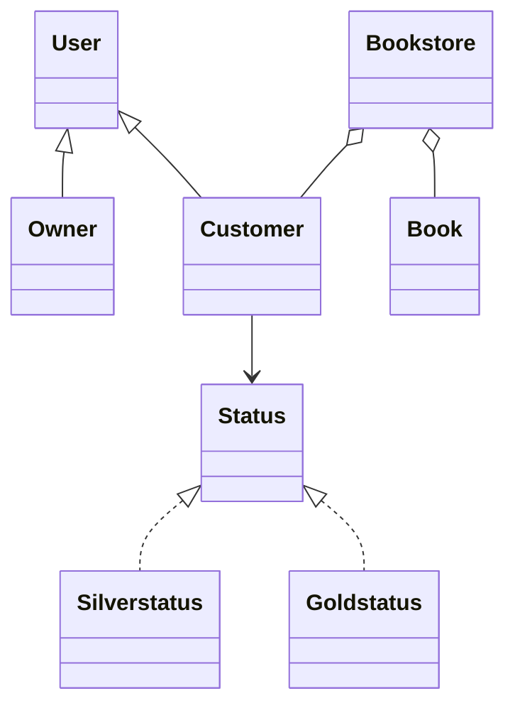

# Java Bookstore Application

A desktop bookstore management and purchasing application built with Java Swing. The application uses a single-window interface, role-based owner and customer workflows, file-based persistence, and the State Design Pattern to manage customer loyalty status.

This project was developed collaboratively by a three-person team for Toronto Metropolitan University's COE 528: Object-Oriented Engineering Analysis and Design course.

## Features

### Owner workflow

- Authenticates through a dedicated owner account.
- Adds and removes books while preventing duplicate titles.
- Registers and removes customer accounts while preventing duplicate usernames.
- Views current book inventory and customer loyalty points.

### Customer workflow

- Authenticates using an owner-created account.
- Selects one or more books from the available inventory.
- Purchases books and earns 10 loyalty points per dollar spent.
- Redeems accumulated points at a rate of 100 points per dollar.
- Receives updated transaction cost, loyalty points, and status after checkout.

### Application behaviour

- Uses `CardLayout` to switch between six screens within one `JFrame`.
- Loads inventory and customer data from `books.txt` and `customers.txt` at startup.
- Saves the current application state when the window is closed.
- Validates duplicate books, duplicate customers, invalid prices, failed logins, and empty purchases.

## State Design Pattern

`Customer` acts as the context and maintains a reference to the current `Status` implementation:

- `Silverstatus`: fewer than 1,000 points
- `Goldstatus`: 1,000 points or more

After every purchase or redemption, the active state evaluates the customer's points and transitions the context when the threshold is crossed. This separates status-transition behaviour from the customer model and makes additional loyalty tiers easier to add.



## Technology

- Java 17
- Java Swing
- NetBeans-compatible Ant project
- Object-oriented design and UML modelling
- State Design Pattern
- Text-file persistence

## Run the application

### NetBeans

1. Install JDK 17 and NetBeans.
2. Select **File > Open Project** and choose this repository.
3. Run the project. The configured main class is `bookstoreapp.BookstoreApp`.

### Command line

From the repository root:

```bash
mkdir -p out
javac -d out src/bookstoreapp/*.java
java -cp out bookstoreapp.BookstoreApp
```

On Windows PowerShell, create the output directory with `mkdir out` before running the same `javac` and `java` commands.

## Demo access

- Owner: `admin` / `admin`
- Customer: `demo` / `demo`

The owner can create additional customer accounts from the Customers screen.

## Data files

The application uses simple comma-separated text files:

- `books.txt`: `book name,price`
- `customers.txt`: `username,password,points`

This is an academic desktop application. Passwords are stored as plain text to satisfy the original project specification and should not be used as a production authentication design. Use demonstration credentials only.

## Repository hygiene

Compiled classes, generated build output, and user-specific NetBeans settings are intentionally excluded. The repository contains sanitized demonstration data and does not include student numbers or the original signed course report.
