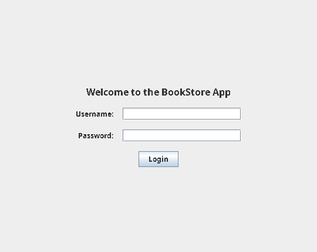
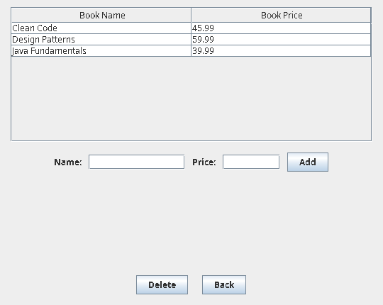
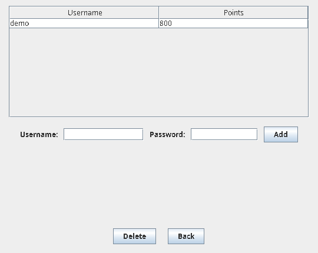
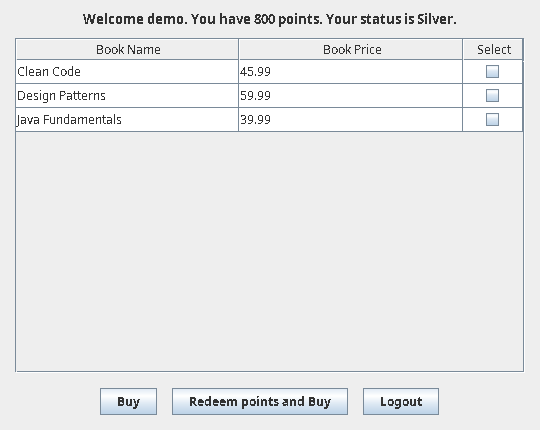
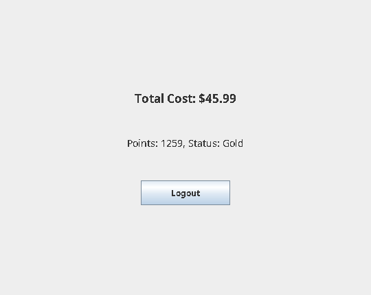

# Bookstore Application

**Java 17 · Swing · Object-Oriented Design · State Pattern · File Persistence**

A desktop bookstore application with separate owner and customer experiences. Owners manage books and customer accounts; customers purchase books, earn loyalty points, and redeem points toward purchases.

Built by a **three-person team** for **COE 528: Object-Oriented Engineering Analysis and Design** at Toronto Metropolitan University.

## At a glance

| Area | Implementation |
| --- | --- |
| Interface | Java Swing, six screens in one `JFrame` using `CardLayout` |
| Roles | Owner and customer authentication and workflows |
| Loyalty | 10 whole points per dollar paid; redeem 100 points per dollar |
| Status | Silver below 1,000 points; Gold at 1,000 points or more |
| Storage | UTF-8 `books.txt` and `customers.txt` |
| Verification | Java 17 GitHub Actions build and dependency-free regression tests |

## My contributions

As part of the three-person team, **Bhavya Patel** contributed to the Swing UI and screens, purchasing and loyalty-points logic, State Pattern implementation, persistence and authentication, UML design, and project documentation. This is a collaborative course project, not a solo build.

## Application walkthrough

1. Sign in as the **owner** to add or remove books and create customer accounts.
2. Sign out and sign in as a **customer**.
3. Select books and choose **Buy** to earn loyalty points, or **Redeem points and Buy** to apply available points.
4. View the transaction cost, remaining points, and Silver/Gold status.
5. Close the window to save books and customers; the data is loaded on the next launch.

### Owner features

- Add and remove books; reject duplicate titles and invalid prices.
- Create and remove customers; reject duplicate usernames.
- View customer points without displaying passwords in the customer table.
- Mask passwords when entering a new customer account.

### Customer features

- Select books from the inventory table.
- Earn **10 whole points per dollar paid**, rounding fractional points down.
- Redeem up to **100 points per $1**, limited by the purchase cost.
- Automatically transition between **Silver** and **Gold** at 1,000 points.

## Design

`Customer` is the **State Pattern context**. `Silverstatus` and `Goldstatus` implement `Status` and update the customer's state as their points change.

**Class relationships (text diagram; no Mermaid renderer required):**

```text
User
├── Owner                  extends User
└── Customer               extends User
    └── Status             current loyalty state
        ├── Silverstatus   implements Status
        └── Goldstatus     implements Status

Bookstore
├── Book                   stores book records
└── Customer               stores customer records
```

The diagram shows class relationships rather than an exhaustive list of fields and methods; see [`src/bookstoreapp/`](src/bookstoreapp/) for the actual Java definitions.

`Bookstore` manages the inventory, customer accounts, authentication, and text-file storage. Each data file is written to a temporary sibling file before replacing its previous version. **The two files are replaced independently, not as one database transaction.** If saving fails on window close, the app shows an error and remains open.

## Run locally

**Requirements:** JDK 17; a desktop environment capable of displaying Swing windows. NetBeans is optional.

### NetBeans

Open this repository as a project and run the configured main class, `bookstoreapp.BookstoreApp`.

### macOS / Linux terminal

From the repository root:

```bash
mkdir -p out
javac -d out src/bookstoreapp/*.java
java -cp out bookstoreapp.BookstoreApp
```

### Windows PowerShell

```powershell
New-Item -ItemType Directory -Force out | Out-Null
javac -d out src/bookstoreapp/*.java
java -cp out bookstoreapp.BookstoreApp
```

**Run from the repository root:** the application reads and writes `books.txt` and `customers.txt` in the current working directory. Back up those files before experimenting; closing the application saves changes to them.

### Demo credentials

| Role | Username | Password |
| --- | --- | --- |
| Owner | `admin` | `admin` |
| Customer | `demo` | `demo` |

The owner can create additional demo customers.

## Run the tests

```bash
mkdir -p out
javac -d out src/bookstoreapp/*.java test/bookstoreapp/*.java
java -ea -cp out bookstoreapp.BookstoreRegressionTest
```

In PowerShell, create `out` using the command shown above. The regression suite covers purchase and redemption calculations, loyalty thresholds, validation, save/load round trips, repeated loads, malformed records, and save failures. The same compile-and-test sequence runs through [GitHub Actions](.github/workflows/java.yml).

## Data and security limitations

- `books.txt`: `book name,price`
- `customers.txt`: `username,password,points`
- Passwords are stored in **plain text**, as in the original academic specification. The masking in the GUI is a display improvement, **not encryption or secure password storage**. Use demo credentials only.
- This is a local desktop teaching project, **not a production e-commerce or payment-processing system**.
- Do not commit real credentials or personal customer information.

## Screenshots

Actual screenshots captured from the running Java Swing application using demonstration data.

| Login | Owner — books |
| --- | --- |
|  |  |

| Owner — customers | Customer — select books |
| --- | --- |
|  |  |

**Purchase result**


